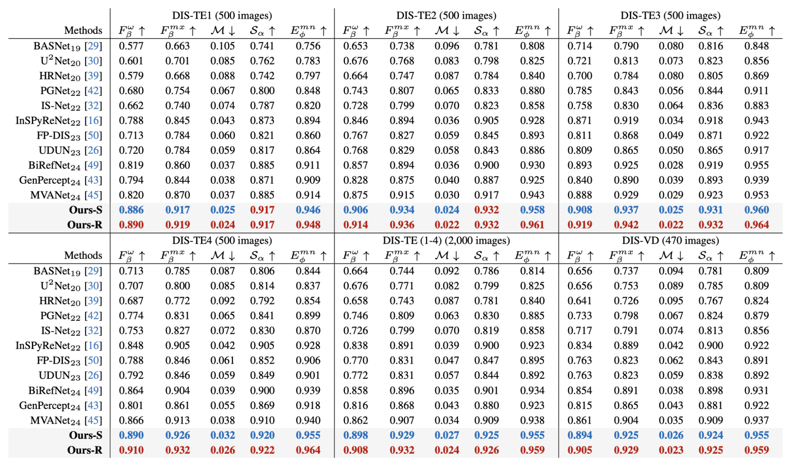
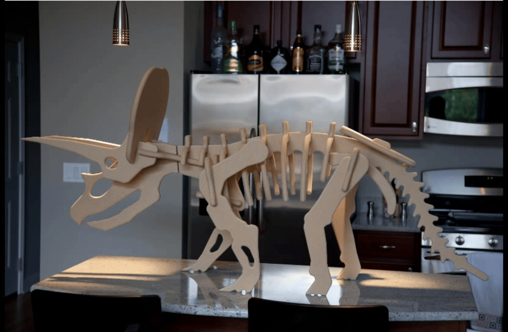

# <p align=center>`LawDIS: Language-Window-based Controllable Dichotomous Image Segmentation (ICCV 2025)`</p>

This repo contains the source code and prediction results of our paper [_LawDIS: Language-Window-based Controllable Dichotomous Image Segmentation_](https://arxiv.org/pdf/) accepted by ICCV 2025. In this paper, we present LawDIS, a language-window-based controllable dichotomous image segmentation (DIS) framework that produces high-quality object masks. 

> **Authors:**
> [Xinyu Yan](https://github.com/XinyuYanTJU),
> [Meijun Sun](https://sunmeijun.github.io/),
> [Ge-Peng Ji](https://github.com/GewelsJI),
> [Fahad Shahbaz Khan](https://sites.google.com/view/fahadkhans/home),
> [Salman Khan](https://salman-h-khan.github.io/),
> [Deng-Ping Fan](https://dengpingfan.github.io/).


## 🚀 1. Features

<p align="center">
     <br />
    <em> 
    Fig. 1: Illustration of the proposed macro and micro controls for DIS. The macro mode enables users to segment objects with customised language prompts, while micro mode supports post-refinement on user-defined windows at any scale. After refinement, our results become more precise, whereas the runner-up model, MVANet, lacks adaptability to the cropped local patches, resulting to inferior predictions.
    </em>
</p>

- **Framework innovation.** We recast the DIS task as an image-conditioned mask generation problem within a latent diffusion model. This enables LawDIS to seamlessly integrate both macro and micro user controls under a unified model and a shared set of parameters.

- **Dual control modes.** LawDIS employs a mode switcher to coordinate two distinct control modes. In macro mode, a language-controlled segmentation strategy (LS) generates an initial mask guided by user prompts. In micro mode, a window-controlled refinement strategy (WR) supports unlimited refinements on user-specified regions via size-adjustable local windows, enabling precise delineation of fine structures.

- **Flexible adaptation.** LS and WR can function independently or in collaboration. Their joint use meets high-accuracy personalized demands, while the micro mode (WR) alone can serve as a general-purpose post-refinement tool to enhance outputs from any segmentation model.

- **Superior performance.** Extensive evaluations on the DIS5K benchmark demonstrate that LawDIS consistently outperforms 11 state-of-the-art methods. Compared to the second-best model MVANet, LawDIS achieves a 3.6% $F_\beta^\omega$ improvement using LS alone, and a 4.6% gain when combining both LS and WR on DIS-TE.

## 📢 2. News
- **2025.06** 🎉 Our paper has been accepted by **ICCV 2025**!  
- **2025.07** 💻 We have open-sourced the **core code** of LawDIS!

> This project is still a work in progress, and we invite all to contribute to making it more accessible and useful. If you have any questions about our paper, feel free to contact me via e-mail (xinyuyan@tju.edu.cn). If you are using our code for your research, please cite this paper ([BibTeX](#4-citation)).

## ♟️3. Proposed Framework
<table align="center">
  <tr>
    <td align="center" valign="top" >
      <br/>
      <div style="height: 50px;">
        <sub><em>Fig. 2: An overview of the U-Net training protocol in LawDIS.</em></sub>
      </div>
    </td>
    <td align="center" valign="top" >
      <br/>
      <div style="height: 50px;">
        <sub><em>Fig. 3: Overview of the inference protocol, which consists of two steps.</em></sub>
      </div>
    </td>
  </tr>
</table>


## 🛠️ 4. Setup

### 4.1. Repository
Clone the repository (requires git):
```bash
git clone https://github.com/XinyuYanTJU/LawDIS.git
cd LawDIS
```

### 4.2. Dependencies
#### ✅ Step 1. Install the dependencies:
```bash
conda create -n=lawdis python=3.8
conda activate lawdis
pip install -r requirements.txt
```

#### ✅ Step 2. Integrate Custom VAE into `diffusers`

This project uses a custom VAE class `AutoencoderKlLawDIS` that needs to be manually added into the `diffusers` library.

##### (1) Locate `diffusers` in your environment

Check the installed location:

```bash
pip show diffusers
```

##### (2) Create a symbolic link to `diffusers` in your repo root

Replace `/path/to/your/venv` with the actual path from the previous step:

```bash
ln -s /path/to/your/venv/lib/python3.x/site-packages/diffusers ./diffusers
```

##### (3) Copy custom VAE implementation

Copy the custom model files:

```bash
cp lawdis_diffusers/* diffusers/models/autoencoders/
```

##### (4) Register `AutoencoderKlLawDIS` in the `diffusers` package

Modify the following files in the `diffusers` package to include the new model:

- `diffusers/models/autoencoders/__init__.py`  
  Add at line **9**:
  ```python
  from .autoencoder_kl_lawdis import AutoencoderKlLawDIS
  ```

- `diffusers/models/__init__.py`  
  Add at line **31**:
  ```python
  _import_structure["autoencoders.autoencoder_kl_lawdis"] = ["AutoencoderKlLawDIS"] 
  ```  
  And at line **82**:
  ```python
  AutoencoderKlLawDIS,
  ```

- `diffusers/__init__.py`  
  Add at line **82**:
  ```python
  "AutoencoderKlLawDIS",
  ```
  
  And at line **546**:
  ```python
  AutoencoderKlLawDIS,
  ```
### 4.3. Inference
#### ✅ Step 1. Download the Checkpoints

Download the pre-trained [checkpoints](https://pan.baidu.com/s/1DGqK_Nl3ccv_pi4mIOMndw) (access code: `2025`) from Baidu Netdisk.  
Place the checkpoint files under:

```bash
.stable-diffusion-2/
```

---

#### ✅ Step 2. Inference in **Macro** Mode

We provide scripts for:
- **Batch testing** a dataset
- Testing **a single image** with multiple language prompts

**Batch Testing**

Update the `--checkpoint`, `--input_rgb_dir`, `--subset_name`, and `--output_dir` in `run_infer_macro.sh`. Then run:

```bash
bash run_infer_macro.sh
```

**Single Image with Prompts**

Update the `--checkpoint`, `--input_img_path`, `--prompts`, and `--output_dir` in `run_infer_macro_single.sh`. Then run:

```bash
bash run_infer_macro_single.sh
```

---

#### ✅ Step 3. Inference in **Micro** Mode

We provide scripts for:
- **Batch testing** a dataset
- Testing **a single image**

You can choose how to generate the refinement windows using `--window_mode`:
- `"auto"`: Automatically select windows based on object edges in the initial segmentation map.
- `"semi-auto"`: Simulate user-guided selection using GT segmentation.
- `"manual"`: User manually selects windows (⚠️ Only works on **local servers**).

**Batch Testing**

Update the `--checkpoint`, `--input_rgb_dir`, `--subset_name`, `--init_seg_dir`, `--output_dir`, and `--window_mode` in `run_infer_micro.sh`. Then run:

```bash
bash run_infer_micro.sh
```

**Single Image Testing**

Update the `--checkpoint`, `--input_img_path`, `--init_seg_dir`, `--output_dir`, and `--window_mode` in `run_infer_micro_single.sh`. Then run:

```bash
bash run_infer_micro_single.sh
```
## 🏋️ 5. Results

The [predicted segmentation maps](https://pan.baidu.com/s/1em-6dEh2Qr2si17zi-CCxg) (access code: `lawd`) of both **Macro** and **Micro** modes can be downloaded from Baidu Netdisk.

<p align="center">
     <br />
    <em> 
    Fig. 4: Quantitative comparison of DIS5K with 11 representative methods.
    </em>
</p>

<p align="center">
     <br />
    <em> 
    Fig. 5: Qualitative comparison of our model with four leading models. Local masks are evaluated with MAE score for clarity.
    </em>
</p>

## 🎮 6. Applications
Due to its capability of achieving high-precision segmentation of foreground objects at high resolutions, our LawDIS enables extensive application across a variety of scenarios. Fig. 6 shows application cases of background removal. As can be seen, compared with the original image, the background-removed image shows higher aesthetic values and good usability, which can even be directly used as: 3D modeling, augmented reality (AR), and still image animation.
<div align="center">
  <table>
    <tr>
      <td></td>
      <td></td>
      <td></td>
    </tr>
  </table>
  <em>
    Fig. 6: Application cases of background-removed results in various scenarios.
  </em>
</div>

<p align="center">
     <br />
    <em> 
    Fig. 7: Application cases of 3D modeling.
    </em>
</p>

<p align="center">
     <br />
    <em> 
    Fig. 8: Application cases of AR.
    </em>
</p>

<p align="center">
     <br />
    <em> 
    Fig. 9: Application cases of still image animation.
    </em>
</p>

## 📦 7. Related work
Our code is based on 

- Marigold: Repurposing Diffusion-Based Image Generators for Monocular Depth Estimation, [Github](https://github.com/prs-eth/marigold)

- Diffusers, [Github](https://github.com/huggingface/diffusers) .

We are grateful to the authors of these projects for their pioneering work and contributions!

## ✏️ 8. To do
- [ ] Training code; 
- [ ] Huggingface app demo.

## 🎓 9. Citations
If you find this code useful, we kindly ask you to cite our paper in your work.
```
@article{LawDIS,
  title={LawDIS: Language-Window-based Controllable Dichotomous Image Segmentation},
  author={},
  journal={},
  year={2025}
}

```
